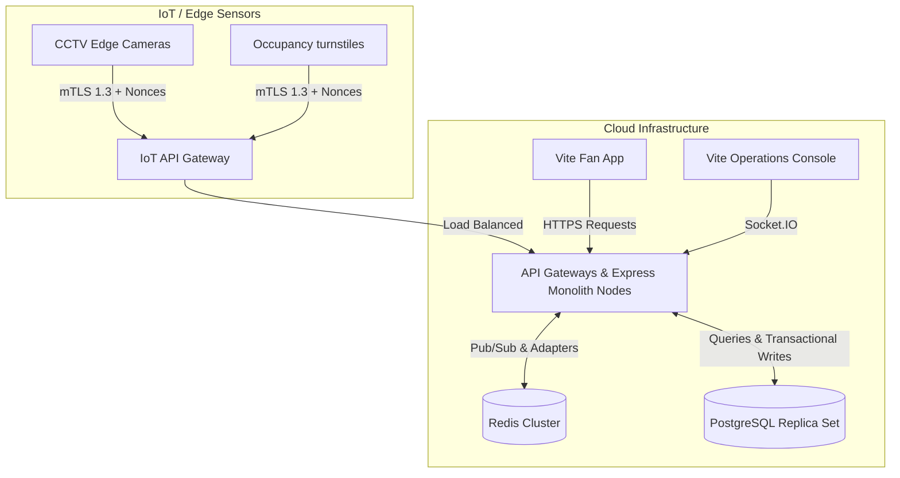

# FIFA World Cup 2026 - Production Deployment Guide
## StadiumAI Operations Platform

This document outlines the recommended production architecture, security controls, database transition paths, and deployment best practices for scaling the StadiumAI platform for the **FIFA World Cup 2026** at MetLife Stadium.

---

## 1. Architectural Topology & Infrastructure

For the production environment, the single-instance in-memory server must be transitioned to a multi-node, auto-scaling microservices architecture running on a managed container orchestrator (e.g., AWS EKS or GCP GKE).

---

## 2. Database Transition Plan (In-Memory to Production)

The hackathon's in-memory mock store (`db.js`) is replaced by a split-database layout for durability, write-scalability, and rapid read-access:

### 2.1 PostgreSQL (Transactional Storage)
Used for structured, relational, transactional data where ACID compliance is required.
* **Target Schemas:**
  - `users`: User registration, ticket classes, hashed passwords, roles.
  - `alerts`: Auditable incident history, assignment logs, and resolution details.
  - `notifications`: Broadcast history and persistent notifications for fans.
* **Scale-Out Strategy:** Utilize a primary database instance for writes, coupled with read-replicas inside the local cloud region to handle fan querying loads during peak match hours.

### 2.2 Redis Cluster (High-Performance Caching & Telemetry)
Used for transient, high-velocity data points and synchronization.
* **Target Schemas:**
  - **Crowd Telemetry Cache:** Stores the latest fused gate occupancy densities (replacing in-memory TTL caching) with a low time-to-live (e.g., 3 seconds).
  - **LLM response deduplication:** TTL-based caching for identical fan queries (minimizing LLM token costs and processing latencies).
  - **Socket.IO Adapter:** Manages the horizontal scaling of WebSocket connections across multiple server replicas.
  - **Rate Limiter Store:** Tracks client IP/API token request counts to enforce rate limits across the scaling API gateway instances.

---

## 3. High-Availability & WebSocket Scaling

Because a single server cannot support 80,000+ concurrent connections at MetLife Stadium, horizontal socket scaling is critical:

1. **Redis Adapter integration:** Configure `@socket.io/redis-adapter` to synchronize real-time events across multiple backend server replicas. When a staff operator dispatches an alert, the event is published to Redis and broadcasted to connected sockets across all server instances.
2. **Sticky Sessions:** Enable session affinity (Sticky Sessions) on the ALB (Application Load Balancer) to ensure Socket.IO HTTP handshake requests are routed to the same container node during reconnection phases.

---

## 4. IoT & Edge Security Controls (ESP32 Safeguards)

To safeguard telemetry against external interception or compromised hardware:

1. **Flash Encryption:** Secure all configurations, credentials, and certificates at rest on ESP32 microcontrollers using hardware-based cryptographic keys fused during factory provisioning.
2. **Secure Boot:** Enforce hardware-signature verification to reject unsigned, malicious custom firmware uploads.
3. **mTLS 1.3 Transmission:** Terminate telemetry ingestion via Mutual TLS (mTLS 1.3) at the Edge Gateway, requiring both the device and server to present valid X.509 certificates.
4. **Replay Attack Protection:** Ingest sensor requests containing a unique cryptographic nonce and standard ISO8601 timestamp. The server must reject any request with a timestamp older than 30 seconds to prevent telemetry replay exploits.

---

## 5. Security & API Hardening Checklist

* **Secrets Isolation:** Under no circumstances should `JWT_SECRET` or database passwords remain hardcoded. Use AWS Secrets Manager, HashiCorp Vault, or Google Secret Manager.
* **Hardened Security Headers:** Maintain the configured Express `helmet` middleware. In production, configure strict Content-Security-Policy (CSP) headers restricting scripts and stylesheets to trusted CDNs.
* **JWT Lifetimes:** Reduce JWT lifetimes from `24h` to `15 minutes`, using secure HTTP-only refresh tokens for session prolongation.
* **CORS Origin Restricting:** Limit `CORS_ORIGINS` to the exact production domains of the Fan Portal and Operator Console. Wildcard (`*`) origins are strictly prohibited.

---

## 6. Continuous Delivery & Quality Gates

To maintain stability, the CI/CD pipeline (GitHub Actions) must enforce:

1. **Mandatory Automated Linting:** ESLint and Oxlint checks must pass before pull-requests can be merged.
2. **Unit & Integration Test Quality Gate:**
   - Command: `npm test`
   - Gate Thresholds: Minimum **85% statement coverage** and **80% branch coverage** across all core business services.
